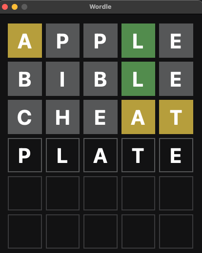

# Wordle Rush

Wordle Rush is a word search game created as part of the 42 Rush school program. In a 48-hour project, our team used Python and the PySide6 library to build a graphical user interface (GUI) for the game.

## What is a Rush?

A "Rush" at School 42 is a project where you and your team have just 48 hours to design, develop, and deliver a functional application. It's a challenge that tests your problem-solving skills, teamwork, and ability to work under tight deadlines.

- [Simon Cros](https://github.com/SimonCROS) (_scros_)
- [Tom Damerose](https://github.com/tdameros) (_tdameros_)

## Gameplay

Wordle Rush is a fast-paced word-guessing game where the player's objective is to guess a secret five-letter word within a limited number of attempts. Here's how it works:

1. Launch the game.
2. You will be presented with an empty input field and a set number of attempts.
3. Enter your five-letter guess into the input field and submit it.
4. The game will evaluate your guess and provide feedback:
   * Green square: A correct letter in the correct position.
   * Yellow square: A correct letter but in the wrong position.
   * Gray square: An incorrect letter.
5. Use this feedback to refine your guesses and continue making attempts. 
6. Your goal is to guess the word within the given attempts. If you run out of attempts, the game ends.
7. If you successfully guess the word, you win the game!

## Installation

We developed Wordle using Python, and the GUI was built using PySide6, a library for creating interactive applications.
```
pip3 install -r requirements.txt
python3 main.py
```

## Example

